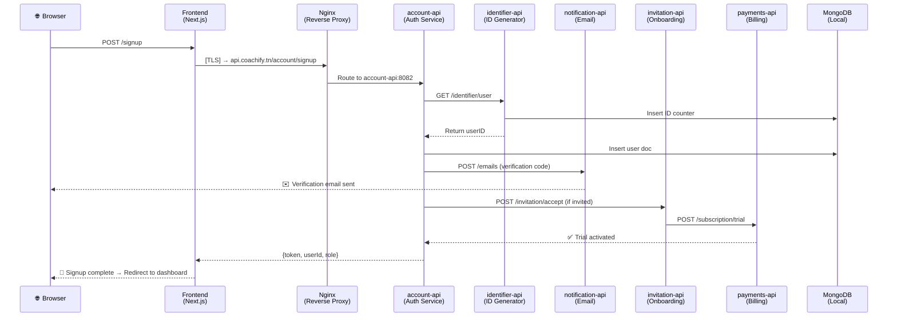
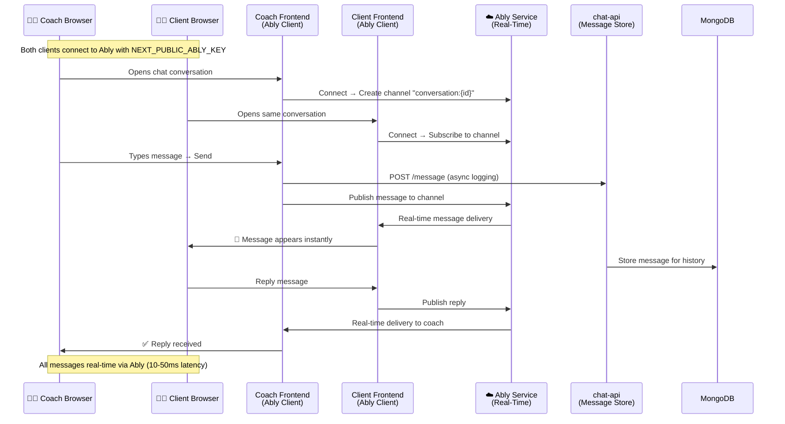
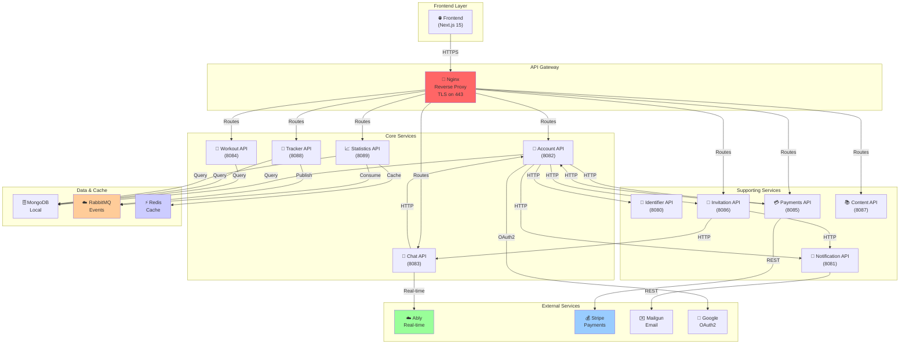
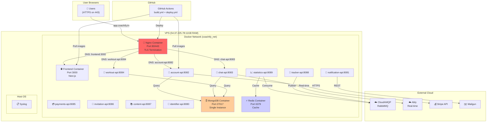
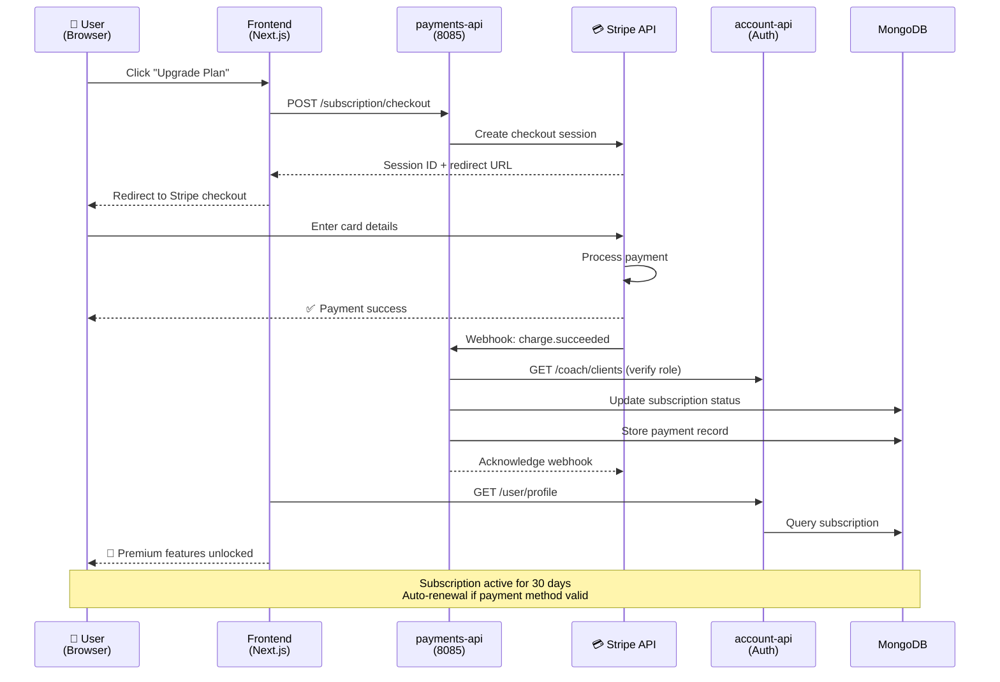
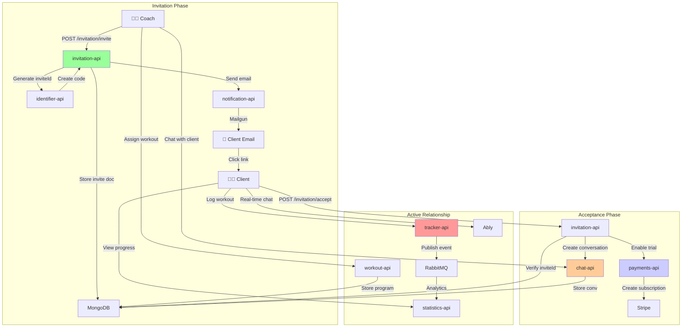
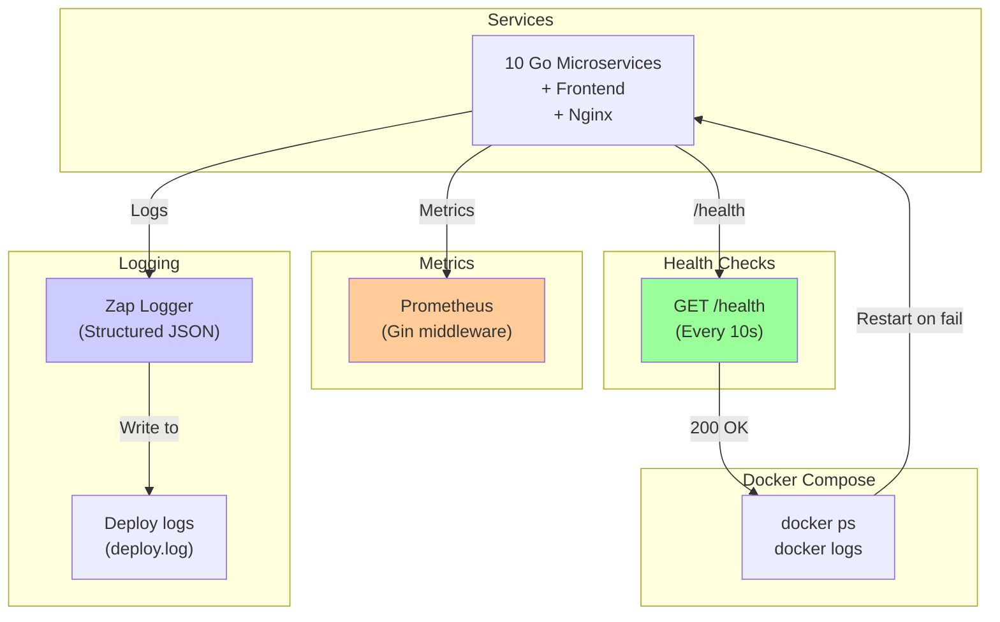

# Coachify Architecture Diagrams & Interaction Flows

This document contains comprehensive visualizations of the Coachify platform architecture, service interactions, and deployment workflows.

---

## 1. User Signup & Authentication Flow



**Flow Details:**
- User submits email/password on frontend → Frontend validates → Calls account-api
- account-api requests unique ID from identifier-api
- User document created in MongoDB with hashed password
- Verification email sent via notification-api (Mailgun)
- If invited: initation-api creates chat conversation and payments-api enables trial subscription
- JWT token returned to frontend for subsequent requests

---

## 2. Real-Time Chat & Message Flow (Ably Integration)



**Key Points:**
- Both clients use `NEXT_PUBLIC_ABLY_KEY` for real-time connection
- Ably handles 100% of message delivery (pub/sub model)
- chat-api logs to MongoDB for message history (async)
- Channels named: `conversation:{conversationId}` for isolation
- Connection pooling on Ably side = scalable to 1000+ concurrent users

---

## 3. Workout Tracking & Analytics Pipeline

```mermaid
graph LR
    subgraph "Real-Time Collection"
        TR1["🏃 Tracker API<br/>(8088)"]
        TR2["📊 Workout Session"]
        TR1 -->|POST /session| TR2
    end
    
    subgraph "Event Bus (RabbitMQ)"
        RMQ["☁️ CloudAMQP<br/>RabbitMQ"]
    end
    
    subgraph "Analytics Layer"
        STATS["📈 Statistics API<br/>(8089)"]
        REDIS["⚡ Redis Cache"]
    end
    
    subgraph "Data Storage"
        MONGO["🗄️ MongoDB<br/>coachify DB"]
    end
    
    subgraph "Frontend Display"
        FE["🌐 Frontend<br/>Dashboard"]
    end
    
    TR1 -->|Publish event| RMQ
    RMQ -->|Consume: workout.session.completed| STATS
    STATS -->|Aggregate stats| REDIS
    STATS -->|Query historical| MONGO
    STATS -->|GET /stats/{clientId}| FE
    FE -->|Display performance| FE
    
    style RMQ fill:#ff9999
    style REDIS fill:#99ff99
    style STATS fill:#99ccff
    style MONGO fill:#ffcc99
```

**Async Data Flow:**
1. Client completes workout → Tracker API stores session
2. Tracker publishes event to RabbitMQ: `workout.session.completed`
3. Statistics API consumes event asynchronously
4. Stats aggregated and cached in Redis (30min TTL)
5. Frontend queries `/statistics/performance/{clientId}` → instant Redis response
6. **Result:** Analytics available within 1-2 seconds, non-blocking

---

## 4. Service Dependency Graph



**Service Roles:**
- **Account API**: User auth, profiles, identity management
- **Chat API**: Stores conversations (Ably handles real-time)
- **Workout API**: Program/exercise management
- **Tracker API**: Session logging & event publishing
- **Statistics API**: Analytics aggregation from RabbitMQ
- **Payments API**: Stripe integration & subscriptions
- **Notification API**: Email service (Mailgun)
- **Invitation API**: Onboarding workflows

---

## 5. Deployment Architecture on VPS



**Key Deployment Facts:**
- All services in single Docker bridge network `coachify_net`
- Service discovery via Docker DNS (e.g., `account-api:8082`)
- MongoDB: Single local instance (172.18.0.1:27017 from container perspective)
- Nginx routes by hostname: `app.coachify.tn` → frontend, `api.coachify.tn` → services
- GitHub Actions auto-deploys on push to main
- All environment variables from `.env.production` on VPS

---

## 6. Payment & Subscription Flow



**Payment Integration:**
- Stripe handles PCI compliance (no card data on our servers)
- Webhook verification prevents fraud
- Subscription status stored in user document
- Auto-renewal via Stripe subscriptions API
- Failed payment → webhook triggers downgrade/notification

---

## 7. Coach-Client Invitation & Onboarding



**Onboarding Workflow:**
1. **Coach initiates**: Coach invites client by email
2. **Invitation sent**: invitation-api generates unique code, sends via email
3. **Client accepts**: Client clicks link, confirms account
4. **Relationship created**: Chat conversation auto-created
5. **Trial activated**: payments-api enables 14-day trial
6. **Full access**: Client can now see assigned workouts and chat

---

## 8. System Health & Monitoring



**Monitoring Approach:**
- Each service exposes `GET /health` endpoint
- Docker Compose health checks restart failed containers
- Prometheus metrics via Gin middleware (p50, p95, p99 latencies)
- Structured logging with Zap (JSON in production)
- Deploy logs available at `/home/deploy/production/coachify/deploy.log`

---

## Summary

| Component | Purpose | Technology |
|-----------|---------|-----------|
| Frontend | User interface | Next.js 15, React 19, Tailwind |
| Nginx | TLS termination + routing | Nginx reverse proxy |
| Services (10) | Business logic | Go + Gin framework |
| MongoDB | Primary database | Local instance, 172.18.0.1:27017 |
| Redis | Analytics cache | In-memory, 6379 |
| RabbitMQ | Event bus | CloudAMQP (async tracker→stats) |
| Ably | Real-time chat | Managed service |
| Stripe | Payment processing | REST API + webhooks |
| Mailgun | Email delivery | REST API |
| Docker Network | Service discovery | Bridge network (coachify_net) |

---

**Last Updated:** May 10, 2026  
**Architecture Version:** 2.0 (Ably chat integration verified)  
**Deployment:** VPS 54.37.225.78 (11GB RAM)

